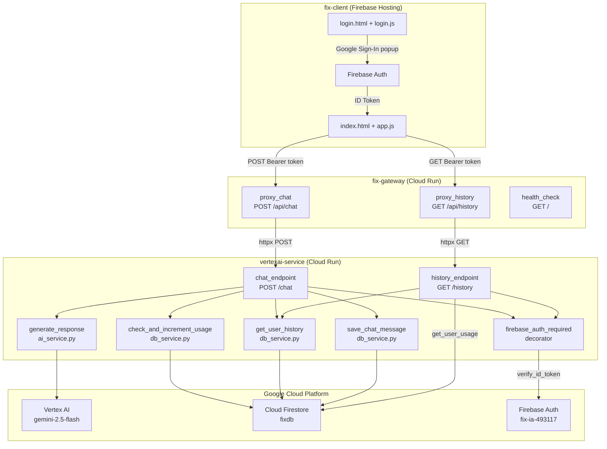
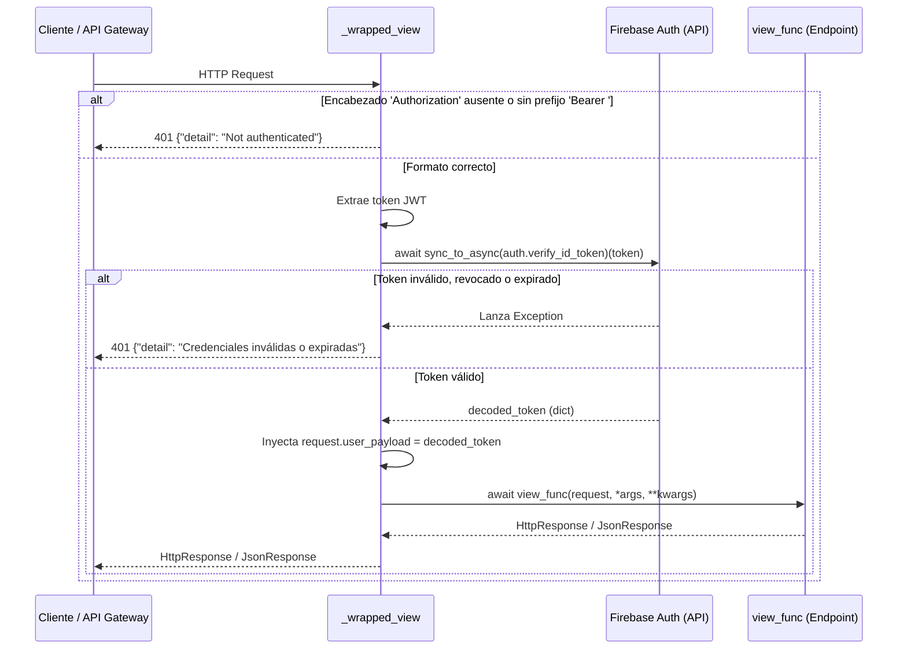

# fix

> Sistema de asistencia técnica basado en IA con arquitectura de microservicios desplegada en Google Cloud. El sistema expone un agente conversacional (Fix) que procesa consultas técnicas de usuarios autenticados, aplica control de cuota por usuario y persiste el historial de interacciones en Firestore.

---

## Descripción y Alcance

fix implementa un pipeline de tres capas para el procesamiento de consultas de lenguaje natural orientadas a soporte técnico:

1. **fix-client**: Interfaz web estática alojada en Firebase Hosting. Gestiona la autenticación de usuarios mediante Firebase Auth (Google Sign-In), mantiene el estado de la sesión en el cliente, y se comunica exclusivamente con `fix-gateway` mediante HTTP con token Bearer.

2. **fix-gateway**: API Gateway asíncrona construida sobre Django + ASGI. Actúa como proxy sin lógica de negocio: valida la presencia del header `Authorization` y reenvía la solicitud al microservicio de núcleo. No verifica el token; esa responsabilidad recae en el microservicio.

3. **vertexai-service**: Microservicio de núcleo que ejecuta la lógica completa: verificación del token Firebase, control de cuota (límite de 10 consultas por usuario), recuperación del historial conversacional desde Firestore, generación de respuesta mediante Vertex AI Gemini y persistencia del par consulta/respuesta.

La comunicación entre `fix-client` → `fix-gateway` → `vertexai-service` es estrictamente REST sobre HTTPS. No existe comunicación directa entre el cliente y el microservicio.

---

## Stack Tecnológico

| Componente | Tecnología | Versión / Notas |
|---|---|---|
| Frontend | HTML + Vanilla JS + CSS | SPA servida desde Firebase Hosting |
| Autenticación cliente | Firebase JS SDK (compat) | Google Sign-In via popup |
| Renderizado Markdown | marked.js | Mensajes del bot |
| Sanitización HTML | DOMPurify | Aplicado sobre salida de marked |
| Resaltado de código | highlight.js | Bloques `<pre><code>` en respuestas |
| Partículas | particles.js | Efecto de fondo |
| Animaciones | GSAP | Botones magnéticos |
| Tilt | VanillaTilt | Cards con efecto 3D |
| API Gateway | Django 6 + ASGI | Uvicorn workers vía Gunicorn |
| HTTP cliente (gateway) | httpx | Comunicación asíncrona gateway → microservicio |
| Validación de esquemas | Pydantic | Ambos servicios Django |
| CORS | django-cors-headers | Configurado con `CORS_ALLOW_ALL_ORIGINS = True` |
| Microservicio core | Django 6 + ASGI | Uvicorn workers, 1 worker, timeout 120s |
| Modelo de IA | Vertex AI `gemini-2.5-flash` | Región `us-central1` |
| SDK IA | google-cloud-aiplatform | `vertexai.generative_models` |
| Base de datos | Cloud Firestore (`fixdb`) | SDK `firebase-admin` |
| Autenticación servidor | firebase-admin | Verificación de ID token |
| Contenedores | Docker (python:3.11-slim) | Ambos servicios Django |
| Plataforma de despliegue | Google Cloud Run | Región `us-central1` |
| Hosting estático | Firebase Hosting | Proyecto `fix-ia-493117` |

---

## Arquitectura del Sistema



---

## Módulos e Integraciones

### fix-client

| Archivo | Responsabilidad |
|---|---|
| `login.html` + `login.js` | Flujo de autenticación. Inicializa `GoogleAuthProvider`, gestiona estados de carga y errores de popup. Redirige a `index.html` si ya existe sesión activa. |
| `index.html` | Estructura del chat: sidebar de navegación, contenedor de mensajes, área de input, panel de historial. |
| `app.js` — objeto `App` | Controlador principal. Gestiona estado de sesión Firebase, envío de mensajes al gateway, renderizado de historial, síntesis de voz (Web Speech API), efectos visuales (particles.js, GSAP, VanillaTilt). |
| `app.js` — objeto `ChatUI` | Capa de presentación del chat. Métodos: `appendMessage`, `typeMessage`, `appendLoading`, `removeMessage`, `scrollToBottom`, `highlightCode`. |
| `firebase-config.js` | Inicialización del SDK Firebase con la configuración del proyecto `fix-ia-493117`. |
| `styles.css` | Estilos globales de la aplicación. |
| `firebase.json` | Configuración de Firebase Hosting: directorio `public`, rewrite catch-all hacia `index.html`. |
| `storage.rules` | Reglas de Firebase Storage. |

### fix-gateway (`gateway_api`)

| Archivo | Responsabilidad |
|---|---|
| `views.py` | Tres vistas asíncronas: `health_check`, `proxy_chat`, `proxy_history`. Valida presencia de `Authorization`, deserializa cuerpo con `ChatRequest` (Pydantic) y reenvía al microservicio mediante `httpx.AsyncClient`. |
| `schemas.py` | Modelo `ChatRequest`: campos `query: str` e `history: List[dict] = []`. |
| `config.py` | Constante `MICROSERVICE_URL` leída desde variable de entorno `MICROSERVICE_URL`. |
| `gateway_project/urls.py` | Enrutamiento: `GET /` → `health_check`, `POST /api/chat` → `proxy_chat`, `GET /api/history` → `proxy_history`. |
| `gateway_project/settings.py` | Configuración Django. CORS habilitado globalmente (`CORS_ALLOW_ALL_ORIGINS = True`). |

### vertexai-service (`core_api`)

| Archivo | Responsabilidad |
|---|---|
| `auth.py` | Decorador `firebase_auth_required`. Extrae el token Bearer, valida contra Firebase Auth usando `sync_to_async` (no bloqueante para el event loop) e inyecta `request.user_payload` con el payload decodificado. |
| `views.py` | `chat_endpoint`: verifica cuota → recupera historial → genera respuesta AI → persiste → retorna. `history_endpoint`: retorna historial y `remaining_queries`. |
| `schemas.py` | `ChatRequest` (`query`, `history` opcional) y `ChatResponse` (`response`, `status`). |
| `services/ai_service.py` | `generate_response(query, history)`: construye el historial de conversación incluyendo el system prompt, inicializa un chat Gemini y llama `send_message_async`. |
| `services/db_service.py` | Cuatro funciones sobre Firestore (colección `users`): `check_and_increment_usage`, `get_user_usage`, `save_chat_message`, `get_user_history`. Todas son síncronas envueltas con `@sync_to_async`. |
| `fix_core/urls.py` | Enrutamiento: `GET /` → `health_check`, `POST /chat` → `chat_endpoint`, `GET /history` → `history_endpoint`. |

---

## Variables de Entorno

### fix-gateway

| Nombre | Tipo | Descripción |
|---|---|---|
| `MICROSERVICE_URL` | `string` | URL base del servicio `vertexai-service`. Default: `https://fix-core-django-473011695031.us-central1.run.app` |

### vertexai-service

| Nombre | Tipo | Descripción |
|---|---|---|
| `GOOGLE_APPLICATION_CREDENTIALS` | `string` | Ruta al JSON de credenciales de GCP (requerido en local; en Cloud Run se usa la Service Account del contenedor). |

> El Project ID de Firebase (`fix-ia-493117`) y el ID de la base de datos Firestore (`fixdb`) están codificados directamente en `auth.py` y `db_service.py`.

---

## Requisitos e Instalación

### Prerequisitos

- Python 3.11
- Node.js + Firebase CLI (`npm install -g firebase-tools`)
- Google Cloud SDK (`gcloud`)
- Docker (para build de imágenes)
- Cuenta de servicio GCP con permisos sobre Vertex AI y Firestore

### fix-gateway (local)

```bash
cd fix-gateway/django_gateway
python -m venv venv
venv\Scripts\activate        # Windows
pip install -r requirements.txt
python manage.py runserver
```

### vertexai-service (local)

```bash
cd vertexai-service/django_microservice
python -m venv venv
venv\Scripts\activate        # Windows
pip install -r requirements.txt
# Configurar credenciales GCP antes de ejecutar
$env:GOOGLE_APPLICATION_CREDENTIALS="C:\ruta\al\service-account.json"
python manage.py runserver
```

### fix-client (local)

```bash
cd fix-client
firebase login
firebase serve
```

---

## Instrucciones de Despliegue

Ambos servicios Django utilizan imágenes Docker sobre `python:3.11-slim` y se despliegan en Cloud Run con Gunicorn + Uvicorn workers escuchando en el puerto `8080`.

### fix-gateway

```bash
cd fix-gateway/django_gateway
docker build -t fix-api-gateway .
gcloud run deploy fix-api-gateway \
  --image fix-api-gateway \
  --region us-central1 \
  --set-env-vars MICROSERVICE_URL=https://fix-core-django-473011695031.us-central1.run.app \
  --allow-unauthenticated
```

### vertexai-service

```bash
cd vertexai-service/django_microservice
docker build -t fix-core-django .
gcloud run deploy fix-core-django \
  --image fix-core-django \
  --region us-central1 \
  --allow-unauthenticated
```

El servicio de núcleo se ejecuta con `--workers 1 --timeout 120` para evitar condiciones de carrera en la inicialización del SDK `firebase-admin` y acomodar la latencia de Vertex AI.

### fix-client

```bash
cd fix-client
firebase deploy --only hosting
```

---

## Documentación Detallada de Componentes

### Componente: `firebase_auth_required` (`vertexai-service/django_microservice/core_api/auth.py`)

## Propósito
Decorador asíncrono para vistas de Django ASGI que intercepta solicitudes HTTP, extrae el token Bearer del encabezado `Authorization` y verifica su validez contra Firebase Auth. Protege el acceso a endpoints sensibles e inyecta el payload del token decodificado en el objeto `request`. Se corrigió para evitar bloqueos del event loop (ASGI) envolviendo la verificación síncrona mediante `sync_to_async`.

## Dependencias e Inyecciones
| Dependencia | Módulo/Librería | Propósito |
|---|---|---|
| `firebase_admin` | `firebase-admin` | Inicialización del entorno de Firebase (`fix-ia-493117`). |
| `auth` | `firebase_admin` | Verificación del ID token contra los servidores de Google. |
| `JsonResponse` | `django.http` | Generación de respuestas de error estandarizadas. |
| `wraps` | `functools` | Preservación de los metadatos de la vista original decorada. |
| `sync_to_async` | `asgiref.sync` | Ejecución no bloqueante del método síncrono `verify_id_token` en un pool de hilos para proteger el event loop principal. |

## Interfaces y Contratos de Datos
### Parámetros de Entrada (Inyectados por Django ASGI)
| Parámetro | Tipo | Descripción |
|---|---|---|
| `request` | `HttpRequest` | Objeto de solicitud HTTP que contiene los encabezados. |
| `*args`, `**kwargs` | `Any` | Argumentos posicionales y variables de la vista original. |

### Objeto de Retorno y Mutaciones
| Condición | Tipo de Retorno | Descripción |
|---|---|---|
| Éxito | `HttpResponse` | Ejecuta y retorna de manera asíncrona el resultado de la vista `view_func` original. **Muta** el `request` inyectando `request.user_payload` (dict decodificado). |
| Falla | `JsonResponse` | Retorna un objeto JSON con la clave `detail` y código de estado HTTP `401 Unauthorized`. |

## Lógica de Control


## Manejo de Errores
| Excepción/Condición Capturada | Acción Resultante | Código HTTP |
|---|---|---|
| `auth_header` vacío o sin `Bearer` | Retorno temprano indicando falta de autenticación. | `401 Unauthorized` |
| `Exception` (desde `verify_id_token`) | Impresión del error en consola (`print`) para depuración interna y bloqueo de la petición. | `401 Unauthorized` |
